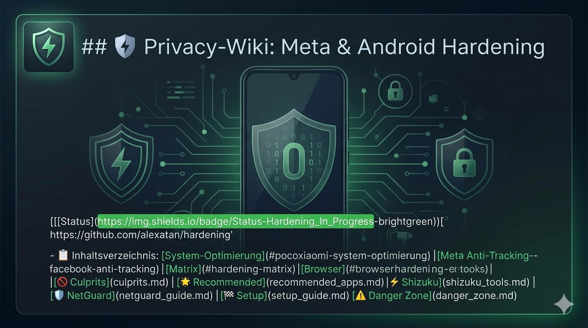

# 🛡️ Privacy-Wiki: Meta & Android Hardening

> ### ⚠️ Wichtiger Sicherheitshinweis (Disclaimer)
> **Die Nutzung der in diesem Repository beschriebenen Methoden erfolgt ausdrücklich auf eigene Gefahr.**
> Das Entfernen von System-Apps oder das Ändern von DNS-Einstellungen kann die Stabilität des Betriebssystems beeinträchtigen.
> * Erstelle **unbedingt ein vollständiges Backup** deiner Daten, bevor du Änderungen vornimmst.
> * Ich übernehme keine Haftung für Schäden, Datenverlust oder defekte Geräte.

---

## 🧠 Bedrohungsmodell (Threat Model)

Nicht jeder benötigt dieselben Datenschutz- und Sicherheitsmaßnahmen. Welche Schritte sinnvoll sind, hängt davon ab, **was du schützen möchtest**, **vor wem** und **wie realistisch die Bedrohung ist**.

Ein Bedrohungsmodell hilft dir dabei, fundierte Entscheidungen zu treffen und unnötige oder ineffektive Maßnahmen zu vermeiden.

---

## 🎯 Assets (Was soll geschützt werden?)

Typische schützenswerte Daten:

- 📩 Nachrichten & Kommunikation  
- 👥 Kontakte  
- 📍 Standortdaten  
- 🖼️ Fotos & Medien  
- 💳 Finanz- und Kontoinformationen  
- 📊 Nutzungs- und Verhaltensdaten  

---

## 🧑‍💻 Bedrohungsakteure (Adversaries)

### 🟢 Kommerziell (Hauptfokus dieses Guides)
- Werbenetzwerke  
- Tracking-SDKs (z. B. in Apps integriert)  
- Datenhungrige Apps & Dienste  

👉 Ziel: Datensammlung, Profilbildung, Monetarisierung  

---

### 🟡 Opportunistisch
- Malware & schadhafte Apps  
- Phishing-Angriffe  
- Datenlecks durch unsichere Apps oder Dienste  

👉 Ziel: Zugriff auf Daten oder Konten ohne gezielte Angriffsplanung  

---

### 🔴 Hochrisiko (Out of Scope)
- Staatliche Akteure  
- Forensische Analyse (z. B. nach Beschlagnahmung)  
- Gezielte Überwachung einzelner Personen  

👉 Für diese Szenarien sind spezialisierte Systeme wie GrapheneOS erforderlich.

---

## ⚙️ Angriffsflächen (Attack Surface)

Typische Wege, über die Daten erfasst oder übertragen werden:

- 📱 App-Berechtigungen (Kontakte, Standort, Speicher etc.)  
- 🌐 Netzwerkverbindungen & Telemetrie  
- ☁️ Cloud-Synchronisation & serverseitige Verarbeitung  
- 🤖 KI-gestützte Funktionen (lokal & cloudbasiert)  
- 📡 Sensoren (Mikrofon, Kamera, Bewegungssensoren)  

---

## ❓ Die drei zentralen Fragen

Bevor du Änderungen vornimmst, solltest du dir fragen:

1. **Was möchte ich schützen?**  
2. **Vor wem möchte ich mich schützen?**  
3. **Wie wahrscheinlich ist dieses Risiko für mich?**  

👉 Im Alltag sind Tracking, Datenaggregation und unsichere Apps meist relevanter als theoretische Hochrisiko-Angriffe.

---

## ⚖️ Der richtige Kompromiss

Sicherheit und Privatsphäre sind keine Alles-oder-Nichts-Entscheidung.

- Mehr Schutz = mehr Aufwand oder weniger Komfort  
- Weniger Einschränkungen = größere Angriffsfläche  

👉 Ziel ist ein **individueller Kompromiss**, der zu deinem Alltag passt.

---

## 🎯 Zielgruppe dieses Guides

Dieser Leitfaden richtet sich an Nutzer, die:

- ihre Privatsphäre gegenüber **Werbenetzwerken und Trackern** verbessern möchten  
- ihre **Angriffsfläche gegenüber alltäglichen Bedrohungen** reduzieren wollen  
- ihr Android-Gerät **sicherer konfigurieren möchten**, ohne auf Alltagstauglichkeit zu verzichten  

---

## ⚠️ Wichtiger Hinweis (Scope & Grenzen)

Dieser Guide ist **nicht für Hochrisiko-Zielgruppen** gedacht (z. B. investigativer Journalismus oder politischer Aktivismus in repressiven Staaten).

In solchen Fällen sind weitergehende Maßnahmen erforderlich, z. B.:

- speziell gehärtete Betriebssysteme (z. B. GrapheneOS)  
- zusätzliche operative Sicherheitsmaßnahmen (OpSec)

---

## 🧾 Kurz gesagt

👉 Ziel ist nicht, jede theoretische Gefahr auszuschließen,  
sondern die Risiken zu reduzieren, die für **dich tatsächlich relevant sind**.

---

## 📋 Inhaltsverzeichnis

### 🏁 Erste Schritte & Grundlagen
- [🛡️ Modulare Strategie (Vorgehensweise)](strategy.md)
- [⚡ Quick-Start Guide (Schritt-für-Schritt)](quick_start.md)
- [🚀 First-Boot Checkliste](setup_guide.md)
- [📊 Hardening Matrix](#hardening-matrix)
- [📧 Sicherheit & Richtlinien](#sicherheit)
- [🍀 Roadmap 2026: Android-Überlebenshilfe](roadmap_2026.md)
  
### 📱 System-Optimierung (Poco/Xiaomi)
- [⚙️ Poco/Xiaomi System-Optimierung](#pocoxiaomi-system-optimierung)
- [🔋 Performance & Akku-Mythen (Hintergründe)](performance_myths.md)
- [📱 Android & Poco Hardening (Systemeinstellungen)](android-settings.md)
- [🚫 Übeltäter-Liste (Culprit Apps)](culprits.md)
- [⚠️ Gefahrenzone (Bloatware Safe-List)](danger_zone.md)
- [🧊 Boot- & Start-Optimierung (Autostart-Killer)](boot_optimization.md)
  
### 🔒 Privacy & Tracking-Schutz
- [👥 Meta (Instagram & Facebook) Anti-Tracking](meta-settings.md)
- [🧪 App-Isolation (Quarantäne)](app_isolation.md)
- [📸 Medien- & Datei-Sicherheit (Metadaten-Schutz)](Media-Hardening.md)
- [📡 Netzwerk-Anonymisierung (Standort-Verschleierung)](network_anonymization.md)
- [🛡️ DNS-Filtering & Kontrolle (Deep-Dive)](dns_deep_dive.md)
- [📧 Anonyme Identitäten (Alias-Strategie)](alias_strategy.md)
- [🔐 2FA-Hardening (Sichere Logins)](2fa_hardening.md)
- [🕵️ Browser-Fingerprinting (Anonym im Netz)](fingerprinting.md)
- [📂 Scoped Storage & Dateimanagement (Daten-Isolation)](scoped_storage.md)
- [🧬 Permission-Hardening & App-Ops (Deep-Dive)](permission_hardening.md)
- [⌨️ Tastatur-Härtung (Eingabe-Privatsphäre)](keyboard_hardening.md)
- [🛰️ Standort-Verschleierung (Mock Locations)](mock_locations.md)
- [📄 Dokumenten-Härtung (Metadaten-Stripping)](document_hardening.md)
- [☁️ Verschlüsselte Synchronisation (Zero-Knowledge)](cloud_encryption.md)
- [📴 Sensoren-Hardening (Hardware-Kill-Switch)](sensor_hardening.md)
- [🛑 Google-Services Hardening (Telemetrie-Stopp)](google_hardening.md)
- [🔗 Link-Privatsphäre (Tracking-Stripping)](link_privacy.md)
- [💬 Sichere Messenger-Alternativen (Element X)](element_x.md)
- [📶 Verbindungssicherheit (MAC-Randomisierung)](mac_randomization.md)
- [🌀 WebView-Hardening (Sicheres In-App Browsing)](webview_hardening.md)
- [🌠 Bluetooth-Verschleierung (Hardware-Identitäts-Schutz)](bluetooth_hardening.md)
- [🌍 De-Googled Sync (Kontakte, Kalender & Cloud-Ersatz)](degoogled_sync.md)
- [👽 KI-Privacy & AI-Opt-Out (HyperOS)](AI-Privacy-HyperOS.md)
  
### 🛠️ Tools & Ecosystem
- [💉 Shizuku Ecosystem](shizuku_tools.md)
- [🧱 NetGuard (Firewall)](netguard_guide.md)
- [🌪️ RethinkDNS (All-in-One Firewall & DNS)](rethinkdns.md)
- [👁️ InviZible Pro (Tor, DNS & I2P Anonymisierung)](invizible_pro.md)
- [🧩 Google-Dienste ersetzen (microG)](microg_guide.md)
- [🌐 Browser-Hardening & Tools](#browser)
- [💎 Empfohlene Apps (Alternativen)](recommended_apps.md)
- [🗑️ Canta (Sicheres Debloating)](canta.md)
- [📦 InstallWithOptions (Kontrollierte Installation)](install-with-options.md)
- [🏪 Neo Store (Sicheres App-Management)](neo-store.md)
- [🔄 Privacy Flip (Profil-Isolation)](privacy-flip.md)
- [🌟 Athena (System-Härtung)](athena.md)
- [🔮 De1984 (System-Aktivitäts-Monitoring)](de1984.md)
- [🔥 App Ops - (Präzise Berechtigungskontrolle)](app_ops.md)
- [❄️ Hail - (Apps effizient einfrieren)](hail.md)
- [🩺 F-Droid & Open Source Basics (Saubere Apps ohne Tracker)](f_droid.md)
- [🛠️ SystemUI Tuner - (Versteckte UI-Einstellungen kontrollieren)](system_ui_tuner.md)
- [🍫 Aurora Store: Anonymes App-Management (Google-ID Isolation)](aurora_store_guide.md)
- [💪 ShizuWall – (Firewall ohne VPN-Zwang)](shizuwall.md)
- [🔪 Shappky – (Hintergrund-Autostart-Killer)](shappky.md)
- [🧹 SD Maid SE – (Gründliche Systemreinigung)](sdmaid_se.md)
- [🐙 Obtanium - (App-Updates direkt von der Quelle)](obtanium.md)
- [🪓 Extirpater -(Freier Speicherplatz-Shredder)](extirpater.md)
- [🦴 UntrackMe  (Link Cleaner: Tracking-Stripping)](untrackme.md)
  
### ⚡ Fortgeschrittene & Wartung
- [🛡️ Physische Sicherheit & Anti-Forensik](physical_security.md)
- [🤖 Automatisierung & Skripte](scripts_guide.md)
- [🏎️ Custom ROMs & Bootloader](custom_rom_guide.md)
- [🔍 Überprüfung & Monitoring (Visual Success)](verification_and_monitoring.md)
- [🔌 Hardware-Schutz & USB-Sicherheit](hardware_hardening.md)
- [🧠 Digitaler Minimalismus & Fokus](mindset_privacy.md)
- [📅 Privacy Check-Up Kalender (Wartungs-Routine)](#privacy-check-up-kalender)
  
### 🆘 Hilfe & Support
- [❓ Häufig gestellte Fragen (FAQ)](faq.md)
- [🚨 Notfall-Kit (Troubleshooting)](emergency_kit.md)
- [🧨 Notfall-Wipe & Diebstahlschutz (Wasted)](emergency_wipe.md)

---

## Poco/Xiaomi System-Optimierung

### 1. System-Ads (MSA) & Tracking deaktivieren
Xiaomi versteckt Werbe-Dienste tief im System. Diese sollten als Erstes deaktiviert werden:
- **Pfad:** `Einstellungen -> Passwörter & Sicherheit -> Autorisierung & Widerruf`.
- **Aktion:** Den Schalter bei **msa** und **miui_daemon** auf AUS stellen.

### 2. Werbe-ID & Personalisierung löschen
- **Pfad:** `Einstellungen -> Datenschutz -> Werbung`.
- **Aktion:** **Werbe-ID löschen** wählen und "Personalisierte Werbung" deaktivieren.

---
### ⚠️ Wichtig: Daten-Leichen nach App-Deinstallation vermeiden

Viele Apps bieten die bequeme Option **„Mit Google anmelden“** (*Sign-in with Google*). Was viele nicht wissen: Wenn du eine solche App einfach nur von deinem Smartphone löschst, bleibt die digitale Verknüpfung im Hintergrund aktiv. Der Anbieter hat über das sogenannte **OAuth-Token** weiterhin theoretischen Zugriff auf deine freigegebenen Google-Kontodaten (z. B. E-Mail-Adresse, Profilinfos).

#### 🛠️ So trennst du die Verbindung endgültig:

Um verwaisten Apps den Zugriff komplett zu entziehen, musst du die Berechtigung direkt in deinem Google-Konto löschen:

1. Öffne die **Einstellungen** deines Smartphones.
2. Navigiere zu **Google** ➔ **Alle Dienste**.
3. Suche nach dem Punkt **Einstellungen für Google-Apps** ➔ **Verbundene Apps** (*Connected apps*).
4. Tippe auf die jeweilige App, die du nicht mehr nutzt, und wähle **„Verbindung trennen“** (bzw. *Zugriff entfernen*).

---
### 🔒 Google-Telemetrie abschalten: „Nutzung & Diagnose“ deaktivieren

Ab Werk sendet Android im Hintergrund fortlaufend Diagnose-, System- und Nutzungsdaten an Google. Laut Google dient dies zur „Verbesserung des Systems“, bedeutet im Klartext aber konstante Telemetrie und Hintergrund-Aktivität.

#### 💡 Welche Vorteile hat das Deaktivieren?
* **Mehr Privatsphäre:** Es werden keine fortlaufenden Berichte über dein Nutzungsverhalten, Systemzustände oder App-Aktivitäten an Google-Server übermittelt.
* **Weniger Hintergrund-Traffic:** Das Gerät sendet weniger unbemerkt Datenpakete im Mobilfunknetz oder WLAN.
* **Potenziell bessere Akkulaufzeit:** Da keine automatischen Diagnoseberichte im Hintergrund generiert und hochgeladen werden müssen, spart das CPU-Zyklen und schont den Akku.

#### 🛠️ So schaltest du die Funktion ab:
1. Öffne die **Einstellungen** deines Smartphones.
2. Navigiere zu **Google** ➔ Tippe oben rechts auf die **drei Punkte (Menü)** oder scrolle direkt zum Bereich Dienste auf dem Gerät.
3. Suche nach dem Punkt **Nutzung & Diagnose** (*Usage & diagnostics*).
4. Stelle den Schalter ganz oben auf **Aus** (deaktiviert).

---
### 📊 Google Privacy Sandbox: „Erfolgsmessung bei Anzeigen“ kappen

Google nutzt neuere Datenschutz-Schnittstellen (Privacy Sandbox), bei denen das System selbst analysiert, wie du auf Werbung reagierst. Bei der „Erfolgsmessung bei Anzeigen“ dürfen Apps und Werbetreibende Informationen von Android anfordern, um statistisch zu erfassen, ob eine Anzeige bei dir zu einem Klick oder Kauf geführt hat.

#### 💡 Welche Vorteile hat das Deaktivieren?
* **Unterbindung von Conversion-Tracking:** Werbenetzwerke können nicht mehr über Android abfragen, welche Werbeaktionen auf deinem Gerät „erfolgreich“ waren.
* **Keine In-App Profilbildung:** Apps erhalten keine Systemdaten mehr darüber, wie du mit Anzeigen interagierst.
* **Echte Datensparsamkeit:** Anstatt deine Interaktionen verzögert im Hintergrund zu melden, blockiert das System jegliche Übermittlung dieser Analysedaten.

#### 🛠️ So schaltest du die Funktion ab:
1. Öffne die **Einstellungen** deines Smartphones.
2. Navigiere zu **Google** ➔ **Alle Dienste** ➔ **Werbung**.
3. Tippe auf den Unterpunkt **Datenschutz bei Werbung**.
4. Wähle den Eintrag **Erfolgsmessung bei Anzeigen** (*Ad measurement*).
5. Stelle den Schalter bei **Erfolgsmessung bei Anzeigen erlauben** auf **Aus** (deaktiviert).
6. *(Optional)* Tippe direkt darunter auf **Analysedaten zurücksetzen**, um bereits lokal gesammelte Berichte sofort zu löschen.

---
### 🛑 Google-Aktivitätseinstellungen einfrieren

Standardmäßig speichert dein Google-Konto chronologisch jeden App-Start, jede Suchanfrage und jeden besuchten Ort.

#### 🛠️ Web- und App-Aktivitäten pausieren:
1. Öffne die **Einstellungen** des Smartphones.
2. Navigiere zu **Google** ➔ **Alle Dienste**.
3. Tippe ganz oben auf **Dein Google-Konto verwalten**.
4. Navigiere zum Reiter **Daten & Datenschutz**.
5. Unter **Aktivitätseinstellungen** findest du die Punkte **Web- und App-Aktivitäten** sowie den **Standortverlauf**.
6. Tippe sie an und setze sie auf **Pausieren** (bzw. Deaktivieren).

---

### 📡 Google-Standortgenauigkeit & Scans minimieren

Auch wenn GPS ausgeschaltet ist, scannt Android im Hintergrund permanent nach WLAN-Netzen und Bluetooth-Geräten in deiner Umgebung, um deinen Standort exakt zu bestimmen und an Google zu senden.

#### 🛠️ 1. WLAN- und Bluetooth-Suche abschalten
Selbst wenn du WLAN oder Bluetooth deaktivierst, bleibt die Suche im Hintergrund oft für Standortdienste aktiv.
1. Öffne die **Einstellungen** ➔ **Standort**.
2. Tippe auf **WLAN- und Bluetooth-Suche** (oder *Sucheinstellungen*).
3. Schalte sowohl die **WLAN-Suche** als auch die **Bluetooth-Suche** auf **Aus**.

#### 🛠️ 2. Google-Standortgenauigkeit deaktivieren
Verhindert, dass Google Mobilfunkzellen und WLANs in der Umgebung nutzt, um dich im Hintergrund zu tracken.
1. Gehe zu **Einstellungen** ➔ **Standort** ➔ **Standortdienste**.
2. Tippe auf **Google-Standortgenauigkeit** (*Google Location Accuracy*).
3. Schalte den Regler auf **Aus** (das Gerät nutzt dann nur noch echtes GPS, wenn eine App es aktiv anfordert).

---  
## 🚀 Launcher-Hardening: Weg vom Stock-Telemetrie-Müll
 Der Standard-Poco/Xiaomi-Launcher ist tief mit System-Analytics verknüpft. Ein Open-Source-Launcher bricht diese Verbindung und spart RAM.

### Top-Empfehlungen (FOSS)
* **Lawnchair 14 (Beta):** Der Goldstandard. Pixel-Look, extrem schnell und absolut sauber.
* **Neo Launcher:** Maximal anpassbar und respektiert deine Privatsphäre zu 100%.
* **Niagara Launcher:** Minimalistisch, perfekt für Einhandbedienung und Fokus.

### ⚠️ HyperOS 2.0 Workaround (Launcher-Wechsel)
Xiaomi erschwert den Wechsel des Standard-Launchers. Wenn "Standard-Apps" blockiert ist:
1.  Gehe zu `Einstellungen -> Apps -> Apps verwalten`.
2.  Tippe auf die drei Punkte oben rechts -> `App-Einstellungen zurücksetzen`.
3.  Drücke den Home-Button -> Wähle deinen neuen Launcher und klicke auf "Immer".
4.  *(Optional)* Nutze **FNG (Fluid Navigation Gestures)**, falls die System-Gesten im Drittanbieter-Launcher haken.
   
---
## Meta (Instagram & Facebook) Anti-Tracking

Meta sammelt Daten über dein Verhalten in anderen Apps. So schränkst du das ein:

### 1. Aktivitäten außerhalb von Meta-Technologien
- **Pfad:** `Kontozentrum -> Deine Informationen und Berechtigungen -> Deine Aktivitäten außerhalb von Meta-Technologien`.
- **Aktion:** **Künftige Aktivitäten trennen** wählen und den bisherigen Verlauf löschen.

---
### 📊 Hardening Matrix (Übersicht)

| Kategorie | Technik / Tool | Empfehlung | Schutzziel |
| :--- | :--- | :--- | :--- |
| **Datenschutz** | DNS-over-TLS | `dns.quad9.net` / `base.dns.mullvad.net` | Filtert Tracking & Malware systemweit |
| **System** | Debloating | **Canta** & **Shizuku** (User-Mode) | RAM-Verbrauch um ~30% senken |
| **Kontrolle** | App-Freezing | **Hail** (via Shizuku) | Legt ungenutzte Apps & Tracker komplett still |
| **Berechtigung**| Berechtigungs-Hardening | **App Ops** | Entzieht versteckte Tracking-Berechtigungen |
| **Netzwerk** | Firewall | **NetGuard** (No-Root) | Kontrolliert App-Traffic & blockt "Nach-Hause-Telefonieren" |
| **Isolation** | Sandbox | **Shelter** / **Insular** | Strikte Trennung von Privat- & Meta-Apps |
| **Kommunikation**| Matrix-Protokoll | **Element X** | Dezentrale E2EE-Alternative ohne Telefonnummer |
| **Identität** | Browser-Hardening | **Mull** / **Cromite** | Schutz vor Fingerprinting & Web-Tracking |
| **Monitoring** | System-Aktivität | **De1984** | Echtzeit-Überprüfung von App-Aktivitäten |
| **Physisch** | Hardware-Schutz | USB-Datenblocker / Cam-Cover | Schutz vor Juice Jacking & Spionage |

---
### 📅 Privacy Check-Up Kalender

Sicherheit ist kein Zustand, sondern ein Prozess. Diese 5-Minuten-Routine hält dein System sauber:

| Intervall | Aktion | Ziel |
| :--- | :--- | :--- |
| **Wöchentlich** | **Cache-Reinigung** | Browser-Verlauf & App-Caches leeren (schützt vor Tracking-Cookies). |
| **Monatlich** | **App-Inventur** | Apps löschen, die 30 Tage nicht genutzt wurden. Weniger Apps = weniger Angriffsfläche. |
| **Monatlich** | **Berechtigungs-Check** | `Einstellungen -> Datenschutz -> Berechtigungsmanager`. Wer nutzt Kamera/Standort ungefragt? |
| **Quartal** | **Backup-Validierung** | Prüfe, ob dein externes Backup noch lesbar ist (Wichtig vor System-Updates!). |
| **Quartal** | **Passwort-Audit** | Ändere Passwörter für kritische Dienste oder prüfe Leaks via "Have I Been Pwned". |

---

## Browser-Hardening & Tools

Ein sicherer Browser ist dein wichtigstes Werkzeug gegen Web-Tracking. Standard-Browser sollten gemieden werden.

### 1. Empfohlene Browser (F-Droid)
- **Mull:** Ein extrem gehärteter Firefox-Fork. Blockiert standardmäßig fast alle Fingerprinting-Versuche.
- **Cromite:** Ein entgoogelter Chromium-Fork mit starkem integriertem Adblocker.

### 2. Systemweites Privates DNS (DoT)
Konfiguriere dies unter `Einstellungen -> (Mehr Verbindungsoptionen)Verbindung & Teilen -> Privates DNS`:
- **Quad9:** `dns.quad9.net` (Hervorragender Schutz vor bösartigen Domains & Malware).
- **Mullvad DNS:** `base.dns.mullvad.net` (Fokus auf Anonymität, striktes No-Logging).
- **AdGuard:** `dns.adguard.com` (Aggressiver Filter für In-App Werbung).

---

## 🤝 Mitwirken
Beiträge sind herzlich willkommen! Du hast eine neue Tracking-App gefunden oder einen Fehler entdeckt?
- Nutze unsere [Issue-Vorlagen](https://github.com/Lexatan/Privacy-Wiki-Meta-Android-Hardening/issues/new/choose).
- Schau in die [CONTRIBUTING.md](CONTRIBUTING.md) für Details.

---

## 🛡️ Sicherheit & Richtlinien
- **Lizenz:** Dieses Projekt ist unter der [MIT-Lizenz](LICENSE) lizenziert.
- **Security Policy:** Sicherheitsrelevante Meldungen bitte gemäß [SECURITY.md](SECURITY.md) einreichen.

---

## ☕ Unterstützung & Dankbarkeit

Dieses Projekt wird in meiner Freizeit entwickelt, gepflegt und regelmäßig erweitert. Wenn dir dieser Leitfaden geholfen hat, dein Gerät sicherer zu machen, und du meine Arbeit unterstützen möchtest, freue ich mich über eine kleine Aufmerksamkeit.

Deine Unterstützung hilft dabei:
* Den Guide bei System-Updates (HyperOS/Android) aktuell zu halten.
* Zeit für neue, tiefgreifende Analysen und Module zu investieren.
* Das Projekt langfristig als kostenfreie Ressource zu erhalten.

Jeder Beitrag ist **vollkommen freiwillig** und wird sehr geschätzt!

**Hier kannst du mich auf einen virtuellen Kaffee einladen:**
👉 [PayPal.me/lexatan81](https://paypal.me/lexatan81)

**Vielen Dank für deine Unterstützung!** 🛡️🚀

<!-- Verifiziertes Original: https://github.com/Lexatan/Privacy-Wiki-Meta-Android-Hardening -->
